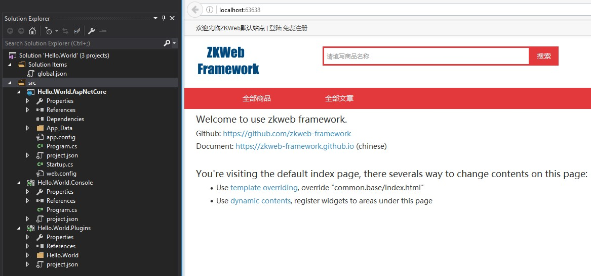

在创建项目前，请准备好以下的工具

- Visual Studio 2015 update 3
- 如果你需要运行在Asp.Net Core上，请安装
	- DotNetCore 1.0.0 Runtime
	- DotNetCore 1.0.0 VS2015 Tooling Preview 2
- 下载ZKWeb和ZKWeb.Plugins项目
	- https://github.com/zkweb-framework/ZKWeb
	- https://github.com/zkweb-framework/ZKWeb.Plugins

准备好以后，打开`ZKWeb\Tools\ProjectCreator.Gui.exe`，创建一个新的项目。 
如果使用的是SQLite以外的数据库，请先创建好一个空的数据库，并点击`Test`测试数据库连接。 
如果需要支持.Net Core请选择Asp.Net Core和NHibernate以外的ORM。 

创建项目时，如果需要下图的效果，需要选择"默认的插件集"。 
点击"Use Default Plugins"右边的"Browse"，然后选中"ZKWeb.Plugins\src\ZKWeb.Plugins\plugin.collection.json"即可。 
注意默认的插件集目前只支持NHibernate，因为EF Core还没有多对多和懒加载的功能，将在以后版本支持。

创建好项目以后，使用Visual Studio打开并运行。 
第一次打开需要编译所有插件，可能会耗时几分钟，请耐心等待。 

部分ORM或数据库支持不完善，如果碰到运行错误请先查看[数据库](database)中的**已知问题**。

### FAQ

<h4>我不想使用默认的插件集，怎么办？</h4>
默认的插件集中包含了比较多的功能，但不一定适合所有人的需要。 
如果不想使用默认的插件集，可以在创建项目时把`Use Default Plugins`留空。 
如果只想使用一部分，可以通过修改`App_Data\config.json`实现，详见[网站配置](website_config)。

<h4>使用了默认的插件集后，怎么进入管理后台？</h4>
后台地址是`/admin`，首次运行网站时应该先注册一个用户并用这个用户登录到后台。 
网站创建后第一个登陆到后台的用户会成为超级管理员。
