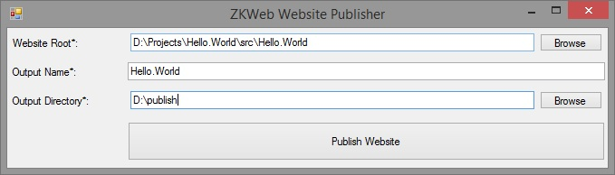

ZKWeb发布网站时需要发布网站程序和插件。<br/>
为了简化发布流程，ZKWeb提供了发布网站的工具。<br/>
打开`ZKWeb\Tools\WebsitePublisher.Gui.exe`<br/>


### 托管到IIS
托管到IIS不需要特别的设置，创建网站并选择发布的文件夹即可。<br/>

### 自宿主
Asp.Net Core和Owin支持自宿主运行网站。<br/>
Asp.Net Core打开主程序即可。<br/>
Owin请修改Console项目并把`项目名.Console.exe`复制到发布文件夹。<br/>

### 通过命令行发布网站
需要自动化发布或有大量网站时，可以使用命令行版本的网站发布器。<br/>
项目路径需要选择包含web.config的目录<br/>
```
ZKWeb\Tools\WebsitePublisher.Cmd.exe -r "项目路径" -n "发布名称" -o "发布路径"
```
