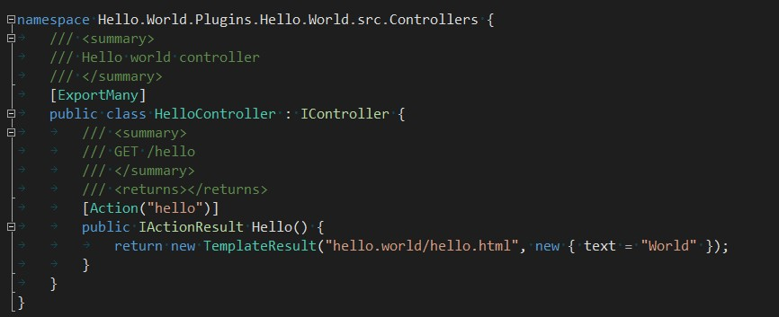
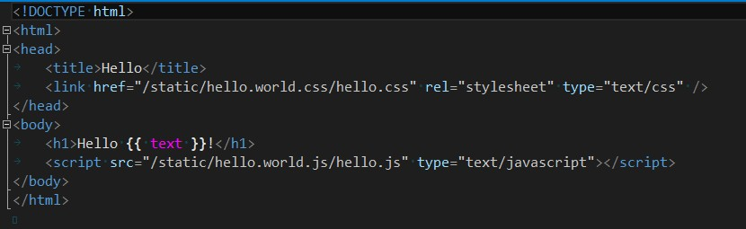
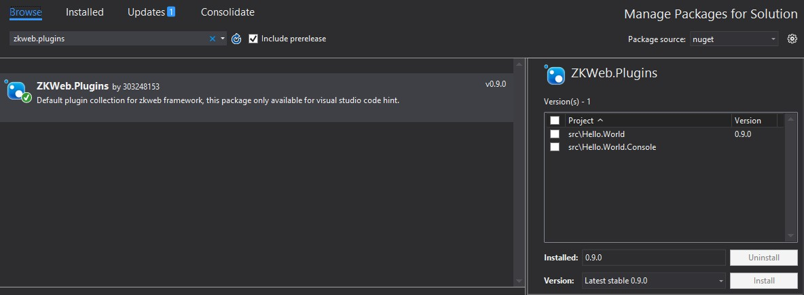

首先您需要知道，在ZKWeb中

- 编写功能都需要通过插件
- 插件是一个文件夹
- 插件中的代码由ZKWeb核心负责编译，VS只提供代码提示功能
- 插件中的组件需要注册到IoC容器

在前一节中，使用项目创建器创建的项目会附带一个新的插件。 

 
您可以打开`HelloController.cs`，在ZKWeb中这是一个标准的控制器。 
`[ExportMany]`属性用于注册组件到容器，`[Action]`属性用于定义函数对应的Url。 
您可以试着修改这里的代码，修改完成后刷新浏览器即可，不需要在Visual Studio中编译。 
具体的解释参考[控制器](controller)。 

 
在上面的控制器中，`/hello`返回了模板`hello.world/hello.html`。 
您可以打开`hello.world/hello.html`，这是一个使用DotLiquid编写的模板文件。 
具体的解释参考[模板引擎](template_engine)。 

 
如果您需要使用默认插件集中的功能，请通过Nuget安装`ZKWeb.Plugins`。 
请注意这个包只用来给VS实现代码提醒，实际的代码仍在`ZKWeb.Plugins`的插件文件夹下。 

 
接下来，您可以参照后面的文档自由实现需要的功能。 
如果您遇到问题可以在Github中提出新的Issue，或在QQ群522083886提问。 
