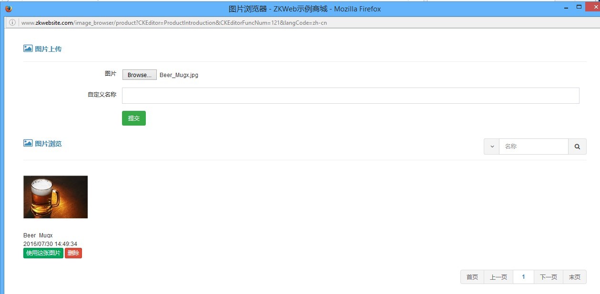

图片管理器插件提供了富文本编辑器使用的图片上传和管理功能，可以配合`CKEditor`等插件使用。<br/>

### 图片管理器的效果



### 图片管理器的使用

在富文本编辑器中点击图片按钮<br/>


然后在弹出的窗口中点击浏览服务器<br/>


这时会弹出图片管理器的窗口，在里面选取以前上传的图片或上传后再选取即可。<br/>


选取后图片会到图片窗口中，点击保存即可添加到富文本编辑器。<br/>


如果需要直接上传也可以使用上传标签，这样就不需要打开图片浏览器的窗口。<br/>
这里上传的图片也会在图片浏览器中显示。<br/>


### 如何让插件支持图片管理器

图片管理器支持分类进行管理，不会把整个网站所有图片都一起显示在管理器中。<br/>
在自己的插件中使用图片管理器需要先添加添加一个继承`ImageBrowserBuilder`的类，<br/>
以下是文章使用的图片管理器的源代码，可以参考实现自己的图片管理器。<br/>

``` csharp
[ExportMany]
public class ArticleImageBrowser : ImageBrowserBuilder {
	public override string Category { get { return "Article"; } }
}
```

添加以上的类后，需要在表单字段的属性中设置`ImageBrowserUrl`。

``` csharp
[RichTextEditor("Remark", ImageBrowserUrl = "/image_browser/article")]
public string Remark { get; set; }
```

做完以上工作后即可使用图片管理器，不需要其他额外的修改。
