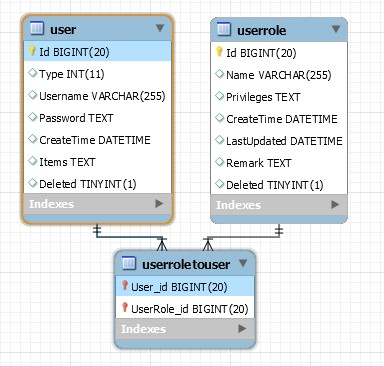

管理员插件包含了用户和权限管理。
用户和管理员都保存在同一个数据表中。

### 用户和权限的数据结构
TODO: 更新这张图片


用户可以对应多个角色，每个角色有不同的权限。<br/>
用户的密码以json保存，默认使用PBKDF2生成密码校验值。<br/>

### 用户类型

管理员插件提供了以下的用户类型

- 普通用户
	- 普通的用户，不能登陆到后台
- 管理员
	- 普通的管理员
- 超级管理员
	- 默认拥有所有的权限的管理员
- 合作伙伴
	- 可以登录到后台，但只能使用非常有限的功能
	- 代理商或进驻商家应该使用这个用户类型

用户类型可以扩展，添加一个继承`IUserType`的类型并注册到容器即可。<br/>
类型还可以同时继承`IAmAdmin`, `IAmSuperAdmin`等现有的接口。<br/>

### 权限

管理员插件支持权限管理，网站中的权限由`IPrivilegesProvider`提供。<br/>
权限是一个字符串，格式推荐是`Group:Name`，例如`AdminManage:View`。<br/>
很多插件支持自动生成权限，例如构建后台CRUD页面时会自动生成增删查改权限。<br/>

需要检查权限时可以使用`PrivilegeManager`
``` csharp
var privilegeManager = Application.Ioc.Resolve<PrivilegeManager>();
privilegeManager.Check(typeof(IAmAdmin), "AdminManage:Edit");
```

### 用户的注册和登陆

管理员插件提供了用户的注册和登陆页面，地址是

- 注册页面 /user/reg
- 登陆页面 /user/login

需要修改样式时可以重载相关的模板文件。
