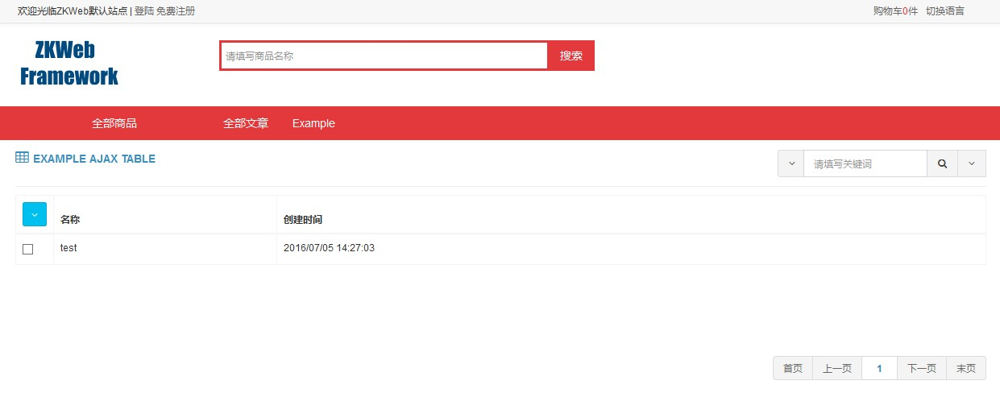
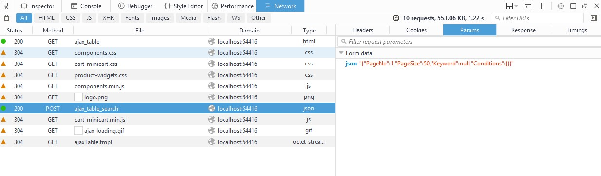

Ajax表格构建器可以用于构建从远程载入内容的Ajax表格，并带分页等支持。<br/>

### 创建Ajax表格

创建Ajax表格分为以下步骤

- 创建`AjaxTableBuilder`，并描画到模板
- 提供搜索地址，搜索地址返回`AjaxTableSearchResponse`的json
	- 搜索可以使用`IAjaxTableCallback`处理

### 创建Ajax表格的例子

**添加控制器，提供表格页面和搜索接口。**<br/>
添加`src\Controllers\AjaxTableExampleController.cs`<br/>
``` csharp
[ExportMany]
public class AjaxTableExampleController : IController {
	[Action("example/ajax_table")]
	public IActionResult AjaxTable() {
		var table = new AjaxTableBuilder();
		table.Id = "ExampleTable";
		table.Target = "/example/ajax_table_search";
		var searchBar = new AjaxTableSearchBarBuilder();
		searchBar.TableId = table.Id;
		searchBar.Conditions.Add(new FormField(new CheckBoxFieldAttribute("Deleted")));
		return new TemplateResult("zkweb.examples/ajax_table.html", new { table, searchBar });
	}

	[Action("example/ajax_table_search", HttpMethods.POST)]
	public IActionResult AjaxTableSearch() {
		var json = HttpManager.CurrentContext.Request.Get<string>("json");
		var request = AjaxTableSearchRequest.FromJson(json);
		var callbacks = new ExampleAjaxTableCallback().WithExtensions();
		var response = request.BuildResponseFromDatabase(callbacks);
		return new JsonResult(response);
	}
}
```

**添加表格回调**<br/>
添加`src\AjaxTableCallbacks\ExampleAjaxTableCallback.cs`<br/>
``` csharp
public class ExampleAjaxTableCallback : IAjaxTableCallback<ExampleTable> {
	public void OnBuildTable(AjaxTableBuilder table, AjaxTableSearchBarBuilder searchBar) { }

	public void OnQuery(
		AjaxTableSearchRequest request, DatabaseContext context, ref IQueryable<ExampleTable> query) {
		if (!string.IsNullOrEmpty(request.Keyword)) {
			query = query.Where(q => q.Name.Contains(request.Keyword));
		}
		bool deleted = request.Conditions.GetOrDefault<string>("Deleted") == "on";
		query = query.Where(q => q.Deleted == deleted);
	}

	public void OnSort(
		AjaxTableSearchRequest request, DatabaseContext context, ref IQueryable<ExampleTable> query) {
		query = query.OrderByDescending(q => q.Id);
	}

	public void OnSelect(
		AjaxTableSearchRequest request, List<EntityToTableRow<ExampleTable>> pairs) {
		foreach (var pair in pairs) {
			pair.Row["Id"] = pair.Entity.Id;
			pair.Row["Name"] = pair.Entity.Name;
			pair.Row["CreateTime"] = pair.Entity.CreateTime.ToClientTimeString();
		}
	}

	public void OnResponse(AjaxTableSearchRequest request, AjaxTableSearchResponse response) {
		response.Columns.AddIdColumn("Id");
		response.Columns.AddMemberColumn("Name");
		response.Columns.AddMemberColumn("CreateTime");
	}
}
```

**添加模板文件**<br/>
添加`templates\zkweb.examples\ajax_table.html`
``` html



<div class="portlet">
	<div class="portlet-title">
		<div class="caption">
			<i class="fa fa-table"></i>
			<span class="caption-subject">Example Ajax Table</span>
			<span class="caption-helper"></span>
		</div>
		{{ searchBar }}
	</div>
	<div class="portlet-body">
		{{ table }}
	</div>
</div>


```

效果如图


### FAQ

**表格构建器`AjaxTableBuilder`必须和`AjaxTableSearchBarBuilder`一起使用吗？**<br/>
如果不需要使用搜索功能，`AjaxTableBuilder`可以单独使用。<br/>

**怎样构建`AjaxTableSearchResponse`，例子中的`BuildResponseFromDatabase`的作用是？**<br/>
`AjaxTableSearchResponse`包含了当前页序号(从1开始)和每行的数据等信息，可以自己构建，
也可以使用`BuildResponseFromDatabase`函数构建，这个函数提供了从数据库获取数据并分页的功能。

**为什么需要使用表格回调，例子中的`WithExtensions`的意思是？<br/>**
表格回调主要用于支持在其他插件中扩展表格的内容，使用`WithExtensions`函数可以获取到所有关联的回调。<br/>
提供关联回调可以继承`IAjaxTableCallbackExtension<TData, TCallback>`并注册到容器。<br/>

**怎样自定义表格的样式？**<br/>
需要指定自定义的表格样式时请修改`AjaxTableBuilder.Template`，<br/>
并参考`static/common.base.tmpl/ajaxTable.tmpl`的内容。<br/>

**怎样添加自定义样式的列，例子中的`AddMemberColumn`的作用是？**<br/>
表格中的每个列都是一个`AjaxTableColumn`对象，可以添加这个对象到`response.Columns`中实现自定义样式。<br/>
`AddMemberColumn`的源代码如下，其中的`<%-%>`是通过underscore.js绑定对象时使用的模板格式。<br/>
``` csharp
public static AjaxTableColumn AddMemberColumn(
	this List<AjaxTableColumn> columns, string member, string width = null) {
	var column = new AjaxTableColumn() {
		Key = member,
		Width = width,
		HeadTemplate = HttpUtils.HtmlEncode(new T(member)),
		CellTemplate = string.Format("<%-row.{0}%>", HttpUtils.HtmlEncode(member))
	};
	columns.Add(column);
	return column;
}
```

**Ajax表格通信时的数据结构是？**


