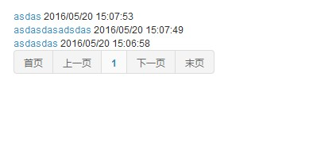

插件包含了通用性高的最基本的功能和资源，可以满足大部分网站的需求。<br/>
在示例项目中使用这个插件时请先引用`Common.Base\bin\Common.Base.dll`，否则VS会提示错误（但不影响ZKWeb加载）。<br/>

----------------------------------------------------------

### <h2>通用配置</h2>

通用配置可以保存网站全局使用的参数，例如网站名称和默认语言等。<br/>
添加`Example\src\config\ExampleConfig.cs`，内容如下<br/>
``` csharp
/// <summary>
/// 示例配置
/// </summary>
[GenericConfig("Example.ExampleConfig", CacheTime = 15)]
public class ExampleConfig {
	public string ExampleName { get; set; }
	public int ExampleCount { get; set; }
}
```

配置需要添加`GenericConfig`属性，第一个参数是保存到数据库时使用的键名，CacheTime可以指定缓存时间（秒）。<br/>
缓存时间不会影响到网站部署到单个进程时的读取，单个进程时读取配置总能读到最新的配置。<br/>
但会影响网站部署到多个进程或服务器时的读取，缓存时间不应该指定太长。<br/>

读取和写入配置<br/>
注意首次获取`ExampleConfig`或之前保存了null值时会返回一个新的实例，GetData不会返回null。<br/>
在`ExampleController`下添加以下内容<br/>
``` csharp
[Action("example/read_config")]
public string ReadConfig() {
	var configManager = Application.Ioc.Resolve<GenericConfigManager>();
	var config = configManager.GetData<ExampleConfig>();
	return JsonConvert.SerializeObject(config);
}

[Action("example/write_config")]
public string WriteConfig() {
	var configManager = Application.Ioc.Resolve<GenericConfigManager>();
	var config = configManager.GetData<ExampleConfig>();
	config.ExampleName = "updated";
	config.ExampleCount++;
	configManager.PutData(config);
	return "success";
}
```

### <h2>定时任务</h2>

定时任务可以用于在网站后台执行定时处理。<br/>
注意网站被IIS回收后，将不会定时执行这些任务（其他的网站内嵌定时任务框架也一样），<br/>
如果需要定时任务必须在指定的时间运行，请设置IIS程序池常驻或使用独立的进程处理。<br/>
定时任务已考虑到部署到多个服务器时的情况，部署到多个服务器仍可以保证任务不被重复执行。<br/>

添加`Example\src\ScheduledTasks\ExampleTask.cs`，内容如下<br/>
这个任务每15分钟写入一次日志<br/>
``` csharp
/// <summary>
/// 示例任务
/// </summary>
[ExportMany, SingletonReuse]
public class ExampleTask : IScheduledTaskExecutor {
	public string Key { get { return "Example.ExampleTask"; } }

	public bool ShouldExecuteNow(DateTime lastExecuted) {
		return ((DateTime.UtcNow - lastExecuted).TotalMinutes > 15);
	}

	public void Execute() {
		var logManager = Application.Ioc.Resolve<LogManager>();
		logManager.LogDebug("Example task executed");
	}
}
```

### <h2>会话</h2>

考虑到网站部署到多个服务器，会话应该保存到数据库中。<br/>
会话会在当前请求期间共享同一个对象，但不会缓存到这个期间外。<br/>

获取和保存会话<br/>
在`ExampleController`下添加以下内容<br/>
调用`SaveSession`可以保存之前使用`GetSession`获取的会话。<br/>
``` csharp
[Action("example/get_session")]
public string GetSession() {
	var sessionManager = Application.Ioc.Resolve<SessionManager>();
	var session = sessionManager.GetSession();
	return JsonConvert.SerializeObject(session, Formatting.Indented);
}

[Action("example/save_session")]
public string SaveSession() {
	var sessionManager = Application.Ioc.Resolve<SessionManager>();
	var session = sessionManager.GetSession();
	session.Items["ExampleKey"] = DateTime.UtcNow;
	sessionManager.SaveSession();
	return "success";
}
```

会话有过期时间，需要延长过期时间时可以使用`SetExpiresAtLeast`函数。<br/>
以下代码设置会话最少有效一个小时<br/>
``` csharp
session.SetExpiresAtLeast(TimeSpan.FromHours(1));
```

### <h2>css样式</h2>

这个插件使用了以下css样式，具体用法可以参考他们的官网<br/>

- Bootstrap 3.3.2
- AdminLTE 2.3.0

### <h2>js脚本</h2>

这个插件使用了以下js脚本，具体用法可以参考他们的官网<br/>

- jQuery 1.11.2
	- jquery-migrate
	- jquery-form
	- jquery-mobile
	- jquery-toast
	- jquery-validate
	- jquery-validate-unobtrusive
- Bootstrap 3.3.2
	- context-menu
	- dialog
	- hover-dropdown
- Switchery 0.8.1
- jsUri 1.3.1
- Underscore 1.8.3

这个插件还带了很多零碎的附加功能，具体可以参考`Common.Base\static\common.base.js\custom`。

### <h2>图标字体</h2>

这个插件使用了以下图标字体，具体用法可以参考他们的官网<br/>

- Font Awesome 4.5.0

### <h2>Ajax表格构建器</h2>

Ajax表格构建器可以用于构建从远程载入内容的Ajax表格，并带分页等支持。<br/>
以下例子没有针对前台显示优化，实际在前台使用时需要其他样式。<br/>
表格构建器可以单独使用，不一定和搜索栏构建器一起使用。<br/>

在`ExampleController`下添加以下内容
``` csharp
[Action("example/table")]
public IActionResult Table() {
	var table = new AjaxTableBuilder();
	table.Id = "ExampleTable";
	table.Target = "/example/table/search";
	var searchBar = new AjaxTableSearchBarBuilder();
	searchBar.TableId = table.Id;
	searchBar.Conditions.Add(new FormField(new CheckBoxFieldAttribute("Deleted")));
	return new TemplateResult("example/example_table.html", new { table, searchBar });
}

[Action("example/table/search", HttpMethods.POST)]
public IActionResult TableSearch() {
	var json = HttpContextUtils.CurrentContext.Request.Get<string>("json");
	var request = AjaxTableSearchRequest.FromJson(json);
	var response = request.BuildResponseFromDatabase(new[] { new ExampleAjaxTableCallback() });
	return new JsonResult(response);
}
```

添加`Example\templates\example\example_table.html`，内容如下
``` html



<div class="portlet">
	{{ searchBar }}
	{{ table }}
</div>


```

添加`Example\src\AjaxTableCallbacks\ExampleAjaxTableCallback.cs`，内容如下
``` csharp
/// <summary>
/// 示例的表格搜索回调
/// </summary>
public class ExampleAjaxTableCallback : IAjaxTableCallback<ExampleTable> {
	/// <summary>
	/// 构建表格时的处理，这里不使用
	/// </summary>
	public void OnBuildTable(AjaxTableBuilder table, AjaxTableSearchBarBuilder searchBar) { }

	/// <summary>
	/// 查询数据
	/// </summary>
	public void OnQuery(
		AjaxTableSearchRequest request, DatabaseContext context, ref IQueryable<ExampleTable> query) {
		if (!string.IsNullOrEmpty(request.Keyword)) {
			query = query.Where(q => q.Name.Contains(request.Keyword));
		}
		bool deleted = request.Conditions.GetOrDefault<string>("Deleted") == "on";
		query = query.Where(q => q.Deleted == deleted);
	}

	/// <summary>
	/// 排序数据
	/// </summary>
	public void OnSort(
		AjaxTableSearchRequest request, DatabaseContext context, ref IQueryable<ExampleTable> query) {
		query = query.OrderByDescending(q => q.Id);
	}

	/// <summary>
	/// 选择数据
	/// </summary>
	public void OnSelect(
		AjaxTableSearchRequest request, List<KeyValuePair<ExampleTable, Dictionary<string, object>>> pairs) {
		foreach (var pair in pairs) {
			pair.Value["Id"] = pair.Key.Id;
			pair.Value["Name"] = pair.Key.Name;
			pair.Value["CreateTime"] = pair.Key.CreateTime.ToClientTimeString();
		}
	}

	/// <summary>
	/// 添加列和操作等
	/// </summary>
	public void OnResponse(AjaxTableSearchRequest request, AjaxTableSearchResponse response) {
		response.Columns.AddIdColumn("Id");
		response.Columns.AddMemberColumn("Name");
		response.Columns.AddMemberColumn("CreateTime");
	}
}
```

效果<br/>

在这个例子中表格使用了`AjaxTableSearchResponse.FromRequest`来构建搜索结果，<br/>
这个函数可以自动从数据库中获取数据，交给表格搜索回调处理并进行分页，<br/>
如果需要自己处理也可以自己构建`AjaxTableSearchResponse`的数据。<br/>
使用表格回调的原因是搜索时可以支持多个回调，这样易于修改其他插件的表格内容。<br/>

默认表格的样式在`static/common.base.tmpl/ajaxTable.tmpl`中，<br/>
如果需要使用自己的样式可以修改`table.Template`。<br/>

### <h2>静态表格构建器</h2>

静态表格构建器和Ajax表格器不同的时，构建的内容需要使用模板绑定并静态显示，不支持通过Ajax更新。<br/>
静态表格的参数来源一般来自url。<br/>

在`ExampleController`下添加以下内容
``` csharp
[Action("example/static_table")]
public IActionResult StaticTable() {
	var request = StaticTableSearchRequest.FromHttpRequest();
	var response = request.BuildResponseFromDatabase(new[] { new ExampleStaticTableCallback() });
	return new TemplateResult("example/example_static_table.html", new { response });
}
```

添加`Example\templates\example\example_static_table.html`，内容如下
``` html



<div class="portlet">
	<div>
		
		<div>
			<a>{{ row.Name }}</a>
			<span>{{ row.CreateTime }}</span>
		</div>
		
	</div>
	
</div>


```

添加`Example\src\StaticTableCallbacks\ExampleStaticTableCallback.cs`，内容如下
``` csharp
/// <summary>
/// 示例的表格搜索回调
/// </summary>
public class ExampleStaticTableCallback : IStaticTableCallback<ExampleTable> {
	/// <summary>
	/// 查询数据
	/// </summary>
	public void OnQuery(
		StaticTableSearchRequest request, DatabaseContext context, ref IQueryable<ExampleTable> query) {
		if (!string.IsNullOrEmpty(request.Keyword)) {
			query = query.Where(q => q.Name.Contains(request.Keyword));
		}
		query = query.Where(q => !q.Deleted);
	}

	/// <summary>
	/// 排序数据
	/// </summary>
	public void OnSort(
		StaticTableSearchRequest request, DatabaseContext context, ref IQueryable<ExampleTable> query) {
		query = query.OrderByDescending(q => q.Id);
	}

	/// <summary>
	/// 选择数据
	/// </summary>
	public void OnSelect(
		StaticTableSearchRequest request, List<KeyValuePair<ExampleTable, Dictionary<string, object>>> pairs) {
		foreach (var pair in pairs) {
			pair.Value["Id"] = pair.Key.Id;
			pair.Value["Name"] = pair.Key.Name;
			pair.Value["CreateTime"] = pair.Key.CreateTime.ToClientTimeString();
		}
	}
}
```

效果<br/>


### <h2>表单构建器</h2>

表单构建器可以构建常用的表单，并支持多种表单字段和客户端+服务端验证。<br/>
默认构建的表单都会带CSRF校验值，防止跨站攻击。<br/>
使用例子<br/>

在`ExampleController`下添加以下内容
``` csharp
[Action("example/form")]
[Action("example/form", HttpMethods.POST)]
public IActionResult Form() {
	var form = new ExampleForm();
	if (HttpContextUtils.CurrentContext.Request.HttpMethod == HttpMethods.POST) {
		return new JsonResult(form.Submit());
	} else {
		form.Bind();
		return new TemplateResult("example/example_form.html", new { form });
	}
}
```

添加`Example\templates\example\example_form.html`，内容如下
``` html



<div class="portlet">
	{{ form }}
</div>


```

添加`Example\src\Forms\ExampleForm.cs`，内容如下<br/>
提示`[Required]`属性找不到时请引用程序集`System.ComponentModel.DataAnnotations`<br/>
``` csharp
/// <summary>
/// 示例表单
/// </summary>
public class ExampleForm : ModelFormBuilder {
	[Required]
	[StringLength(100)]
	[TextBoxField("Name", "Please enter name")]
	public string Name { get; set; }
	[Required]
	[TextBoxField("Age", "Please enter age")]
	public int Age { get; set; }

	protected override void OnBind() {
		Name = "Tom";
		Age = 25;
	}

	protected override object OnSubmit() {
		var message = string.Format("Hello, {0} ({1})", Name, Age);
		return new { message };
	}
}
```

效果<br/>


### <h2>更多的表单字段类型</h2>

插件还提供了以下表单字段类型，使用时请参考各个字段的文档。<br/>

- LabelFieldAttribute(string name)
- TextBoxFieldAttribute(string name, string placeHolder = null)
- PasswordFieldAttribute(string name, string placeHolder = null)
- TextAreaFieldAttribute(string name, int rows, string placeHolder = null)
- CheckBoxFieldAttribute(string name)
- CheckBoxGroupFieldAttribute(string name, Type source)
- CheckBoxGroupsFieldAttribute(string name, Type source)
- CheckBoxTreeFieldAttribute(string name, Type source)
- DropdownListFieldAttribute(string name, Type source)
- SearchableDropdownListFieldAttribute(string name, Type source)
- RadioButtonsFieldAttribute(string name, Type sources)
- FileUploaderFieldAttribute(string name, string extensions = null, int maxContentsLength = 0)
- HiddenFieldAttribute(string name)
- JsonFieldAttribute(string name, Type fieldType)
- HtmlFieldAttribute(string name)

### <h2>数据库操作类</h2>

为了简化数据库操作，这个插件提供了通用仓储`GenericRepository`和工作单元`UnitOfWork`。<br/>
`GenericRepository`提供了共通的操作函数，`UnitOfWork`负责管理数据库上下文和事务的提交。<br/>
使用例子<br/>

在`ExampleController`下添加以下内容
``` csharp
[Action("example/uow")]
public string Uow() {
	// insert data
	string name = RandomUtils.RandomString(5);
	UnitOfWork.WriteData<ExampleTable>(r => {
		var data = new ExampleTable() { Name = name };
		r.Save(ref data);
	});
	// read inserted data
	var readData = UnitOfWork.ReadData<ExampleTable, ExampleTable>(
		r => r.Get(t => t.Name == name));
	return JsonConvert.SerializeObject(readData);
}
```

`UnitOfWork`不支持嵌套，需要多个仓储使用同一个数据库时请使用`RepositoryResolver`<br/>
``` csharp
UnitOfWork.Read(context => {
	var repository = RepositoryResolver.Resolve<ExampleTable>(context);
	var otherRepository = RepositoryResolver.Resolve<OtherTable>(context);
});
```

需要自定义仓储时，可以创建一个仓储类继承`GenericRepository`并注册到IoC容器，<br/>
解决仓储时会自动使用自定义的仓储。<br/>

### <h2>前台页模板</h2>

这个插件提供了以下的前台页模板，如有需要可以根据路径在其他插件中重载。

- common.base\footer.html (前台通用尾部)
- common.base\header.html (前台通用头部)
- common.base\index.html (首页)

### <h2>静态文件处理器</h2>

这个插件提供了静态文件专用的路径`/static/文件路径`，查找规则如下<br/>

- 查找`App_Data\static\文件路径`
- 按插件注册顺序反向查找`插件文件夹\static\文件路径`

例如注册了插件A和B时，查找`/static/a/homepage.js`顺序如下<br/>

- `App_Data\static\a\homepage.js`
- `B\static\a\homepage.js`
- `A\static\a\homepage.js`

### <h2>语言时区处理器</h2>

这个插件可以自动设置当前请求的语言和时区。<br/>
默认语言和时区可以修改通用配置`LocaleSettings`。<br/>

设置语言的顺序是<br/>

- 客户端传入的Cookies (LocaleUtils.LanguageKey: "ZKWeb.Language")
- 客户端浏览器语言，如果`LocaleSettings`设置允许检测浏览器语言
- `LocaleSettings`中的默认语言

设置时区的顺序是<br/>

- 客户端传入的Cookies (LocaleUtils.TimeZoneKey: "ZKWeb.TimeZone")
- `LocaleSettings`中的默认时区

### <h2>特征类</h2>

特征类`Trait`用于在外部标记指定类型的某些特征，但不需要修改原有的类型。<br/>
这个插件提供了以下的特征类<br/>

- EntityTrait (主键名称和类型)
- RecyclableTrait (是否可回收)

使用特征类的例子<br/>
``` csharp
var entityTrait = EntityTrait.For<TData>();
var expression = ExpressionUtils.MakeMemberEqualiventExpression<TData>(trait.PrimaryKey, id);
```

提供自定义特征类需要在插件初始化时注册到IoC容器<br/>
``` csharp
Application.Ioc.RegisterInstance(
	new EntityTrait() { PrimaryKey = "Id", PrimaryKeyType = typeof(Guid) },
	serviceKey: typeof(ExampleTableUseGuidPrimaryKey));
```
