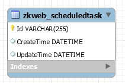

定时任务可以用于在网站后台执行定时处理。<br/>
注意网站被IIS回收后，将不会定时执行这些任务（其他的网站内嵌定时任务框架也一样），<br/>
如果需要定时任务必须在指定的时间运行，请设置IIS程序池常驻或使用独立的进程处理。<br/>
定时任务已考虑到部署到多个服务器时的情况，部署到多个服务器仍可以保证任务不被重复执行。<br/>

### 定时任务的数据结构



### 添加定时任务

定时任务需要继承`IScheduledTaskExecutor`并注册到容器，`Key`返回在数据库中保存的任务名称。<br/>

**定时任务的例子**<br/>
添加`src\ScheduledTasks\ExampleTask.cs`<br/>
这个任务每15分钟写入一次日志<br/>
``` csharp
[ExportMany, SingletonReuse]
public class ExampleTask : IScheduledTaskExecutor {
	public string Key { get { return "ZKWeb.Example.ExampleTask"; } }

	public bool ShouldExecuteNow(DateTime lastExecuted) {
		return ((DateTime.UtcNow - lastExecuted).TotalMinutes > 15);
	}

	public void Execute() {
		var logManager = Application.Ioc.Resolve<LogManager>();
		logManager.LogDebug("Example task executed");
	}
}
```
