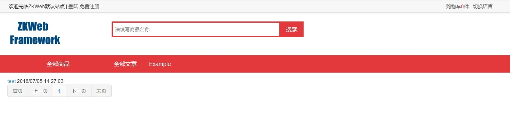

静态表格和Ajax表格不同的是，构建的内容需要使用模板绑定并静态显示，不支持通过Ajax更新。<br/>
静态表格的参数来源一般来自url，适合用在前台页面，可以更好的支持搜索引擎的索引。<br/>

### 创建静态表格

创建静态表格分为以下步骤

- 获取参数并建搜索结果`StaticTableSearchResnponse`
	- 搜索可以使用`IStaticTableCallback`处理
- 描画`StaticTableSearchResnponse`到模板

### 创建静态表格的例子

**添加控制器，从url获取参数搜索并构建搜索结果，然后描画到模板。**<br/>
添加`src\Controllers\StaticTableExampleController.cs`
``` csharp
[ExportMany]
public class StaticTableExampleController : IController {
	[Action("example/static_table")]
	public IActionResult StaticTable() {
		var request = StaticTableSearchRequest.FromHttpRequest();
		var response = request.BuildResponseFromDatabase(new[] { new ExampleStaticTableCallback() });
		return new TemplateResult("zkweb.examples/static_table.html", new { response });
	}
}
```

**添加静态表格回调**<br/>
添加`src\StaticTableCallbacks\ExampleStaticTableCallback.cs`<br/>
``` csharp
public class ExampleStaticTableCallback : IStaticTableCallback<ExampleTable> {
	public void OnQuery(
		StaticTableSearchRequest request, DatabaseContext context, ref IQueryable<ExampleTable> query) {
		if (!string.IsNullOrEmpty(request.Keyword)) {
			query = query.Where(q => q.Name.Contains(request.Keyword));
		}
		query = query.Where(q => !q.Deleted);
	}

	public void OnSort(
		StaticTableSearchRequest request, DatabaseContext context, ref IQueryable<ExampleTable> query) {
		query = query.OrderByDescending(q => q.Id);
	}

	public void OnSelect(
		StaticTableSearchRequest request, List<EntityToTableRow<ExampleTable>> pairs) {
		foreach (var pair in pairs) {
			pair.Row["Id"] = pair.Entity.Id;
			pair.Row["Name"] = pair.Entity.Name;
			pair.Row["CreateTime"] = pair.Entity.CreateTime.ToClientTimeString();
		}
	}
}
```

**添加模板文件**<br/>
添加`templates\zkweb.examples\static_table.html`<br/>
``` html



<div class="portlet">
	<div>
		
		<div>
			<a>{{ row.Name }}</a>
			<span>{{ row.CreateTime }}</span>
		</div>
		
	</div>
	
</div>


```

效果<br/>

