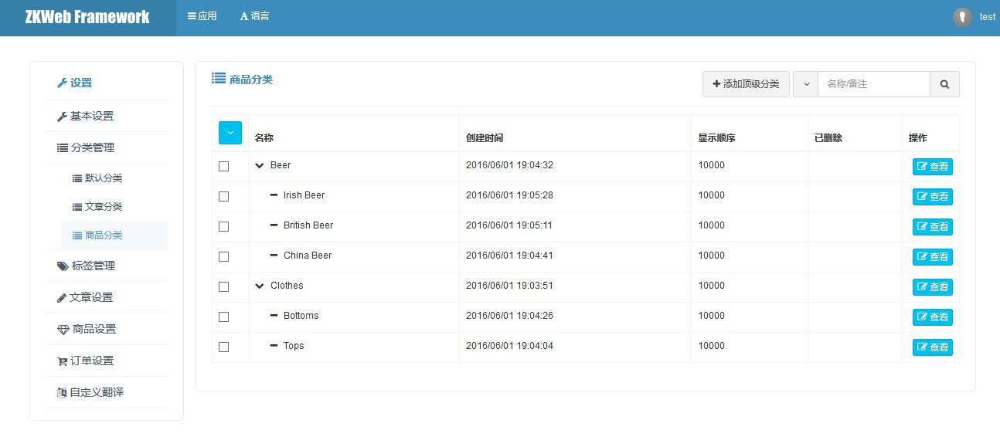

通用分类支持通用的无限级分类功能，<br/>
常用于商品分类和文章分类等需要多级分类的功能。<br/>

### 通用分类的数据结构

TODO

### 通用分类的管理界面



### 如何定义一个新的分类类型

定义一个新的分类类型需要继承`GenericClassBuilder`。<br/>
以下是商品分类的源代码，可以参考实现自己的分类类型。<br/>

```csharp
[ExportMany]
public class ProductClass : GenericClassBuilder {
		public override string Name { get { return "ProductClass"; } }
}
```

### 通用分类的操作

**获取分类树**

```csharp
var classManager = Application.Ioc.Resolve<GenericClassManager>();
var classTree = classManager.GetClassTree("分类类型");
```

**获取分类列表**

```csharp
var classManager = Application.Ioc.Resolve<GenericClassManager>();
var classList = classManager.GetClasses("分类类型');
```
