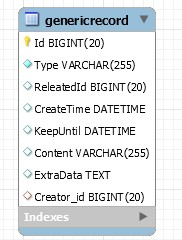

通用记录用于记录流水日志，不推荐记录有业务关联的数据。<br/>
通用记录支持指定关联的数据Id和有效时间，在失效后会自动删除。<br/>

### 通用记录的数据结构



### 通用日志的操作

**添加日志**

``` csharp
var recordRepository = RepositoryResolver.ResolveRepository<GenericRecordRepository>(Context);
recordRepository.AddRecord("日志类型", 关联Id, 创建人Id, 日志内容, 有效时间, 额外数据);
```

**获取日志**

``` csharp
var recordRepository = RepositoryResolver.ResolveRepository<GenericRecordRepository>(Context);
var records = recordRepository.FindRecords("日志类型", 关联Id);
```
