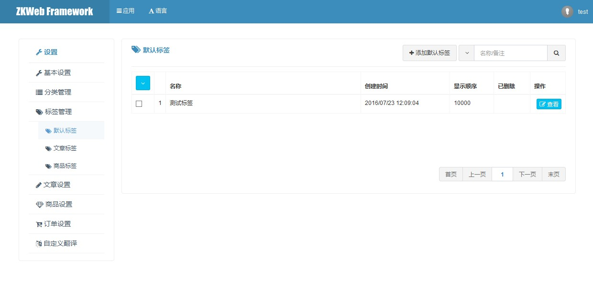

通用标签支持给给数据标记关联的标签，和分类不同的是标签没有层级关系。<br/>
常用于文章标签和商品标签等需要按标签索引的功能。<br/>

### 通用标签的数据结构


### 通用标签的管理界面



### 如何定义一个新的标签类型

定义一个新的标签类型需要继承`GenericTagControllerBase`。<br/>
以下是商品标签的源代码，可以参考实现自己的标签类型。<br/>

```csharp
[ExportMany]
public class ProductTagController : GenericTagControllerBase<ProductTagController> {
	public override string Name { get { return "ProductTag"; } }
}
```

### 通用标签的操作

**获取标签列表**

```csharp
var tagManager = Application.Ioc.Resolve<GenericTagManager>();
var tags = tagManager.GetManyWithCache("标签类型")
```
