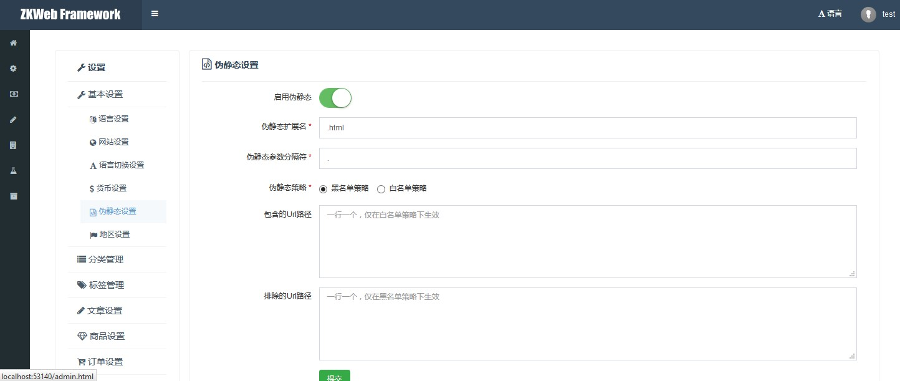

插件提供了带菜单的页面的基础模板。<br/>

### 菜单页的效果



### 菜单页的结构

菜单页分为菜单和页面内容，<br/>
其中各个菜单项的文本和图标和Url由继承了`IMenuProvider`的类提供，<br/>
页面内容则由继承了`SimpleMenuPageBuilder`或`FormMenuPageBuilder`等的类提供。

### 如何构建新的菜单页类型

这个插件仅提供了菜单页的基础类型，<br/>
当创建一个新的菜单页类型（例如后台设置或会员中心）时需要再次封装。<br/>
这里以管理后台的后台设置页为例

``` csharp
public interface IAdminSettingsMenuProvider : IMenuProvider { }
public abstract class AdminSettingsCrudPageBuilder<TData> : CrudMenuPageBuilder<TData>, IAdminSettingsMenuProvider { }
public abstract class AdminSettingsFormPageBuilder : FormMenuPageBuilder, IAdminSettingsMenuProvider { }
public abstract class AdminSettingsSimplePageBuilder : SimpleMenuPageBuilder, IAdminSettingsMenuProvider { }
```

在继承了`PageBuilder`的类中可以重载`TemplatePath`成员实现提供该菜单页默认的模板文件。<br/>
模板文件中需要对菜单内容和页面内容进行描画，这里以`AdminSettingsFormPageBuilder`为例。<br/>

`common.admin_settings/header.html`的内容
``` html


<div class="page-content">
	<div class="panel-sidebar">
		<div class="portlet">
			<div class="portlet-title">
				<div class="caption">
					<i class="fa fa-wrench"></i>
					<span class="caption-subject bold uppercase">{{ "Settings" | trans }}</span>
				</div>
			</div>
			
		</div>
	</div>
	<div class="panel-content">
```

`common.admin_settings/generic_form.html`的内容
``` html


<div class="portlet">
	<div class="portlet-title">
		<div class="caption">
			<i class="{{ iconClass }}"></i>
			<span class="caption-subject">{{ title | trans }}</span>
			<span class="caption-helper"></span>
		</div>
	</div>
	<div class="portlet-body">
		{{ form }}
	</div>
</div>

```

在`header.html`模板中，菜单内容通过了`/api/admin/settings/menu_groups`获取，这个函数的内容如下

``` csharp
[Action("api/admin/settings/menu_groups")]
public IActionResult AdminSettingsMenuGroups() {
	var privilegeManager = Application.Ioc.Resolve<PrivilegeManager>();
	privilegeManager.Check(UserTypesGroup.AdminOrParter);
	var groups = new List<MenuItemGroup>();
	var handlers = Application.Ioc.ResolveMany<IAdminSettingsMenuProvider>();
	handlers.ForEach(h => h.Setup(groups));
	return new JsonResult(groups);
}
```

在完成这些工作后，需要添加新的后台设置页时只要继承`AdminSettingsFormPageBuilder`就可以提供一个完整的页面。
