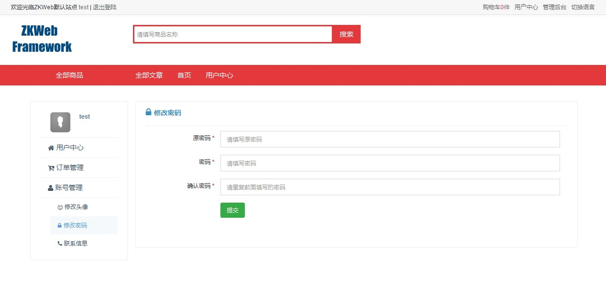
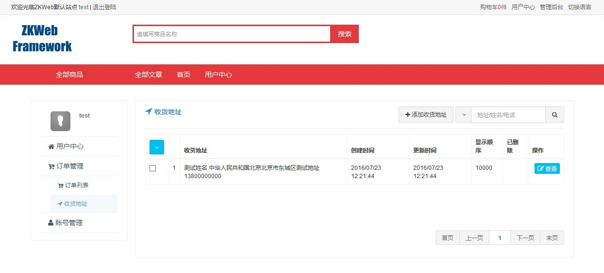

前台会员中心提供了前台用户登录后使用的面板页面。<br/>
前台会员中心也基于菜单页插件实现。<br/>

### 前台会员中心的效果


### 如何添加前台会员中心页（表单）

添加前台会员中心页需要继承`UserPanelFormPageBuilder`。<br/>
以下是修改密码的源代码，可以参考实现自己的设置页面。<br/>


```csharp
/// <summary>
/// 修改自身密码的表单
/// </summary>
[ExportMany]
public class ChangePasswordForm : UserPanelFormPageBuilder {
	public override string Group { get { return "Account Manage"; } }
	public override string GroupIconClass { get { return "fa fa-user"; } }
	public override string Name { get { return "Change Password"; } }
	public override string IconClass { get { return "fa fa-lock"; } }
	public override string Url { get { return "/home/change_password"; } }
	protected override IModelFormBuilder GetForm() { return new Form(); }

	/// <summary>
	/// 表单
	/// </summary>
	public class Form : ModelFormBuilder {
		/// <summary>
		/// 原密码
		/// </summary>
		[Required]
		[StringLength(100, MinimumLength = 5)]
		[PasswordField("OldPassword", "Please enter old password")]
		public string OldPassword { get; set; }
		/// <summary>
		/// 密码
		/// </summary>
		[Required]
		[StringLength(100, MinimumLength = 5)]
		[PasswordField("Password", "Please enter password")]
		public string Password { get; set; }
		/// <summary>
		/// 确认密码
		/// </summary>
		[Required]
		[StringLength(100, MinimumLength = 5)]
		[PasswordField("ConfirmPassword", "Please repeat the password exactly")]
		public string ConfirmPassword { get; set; }

		/// <summary>
		/// 绑定表单
		/// </summary>
		protected override void OnBind() { }

		/// <summary>
		/// 提交表单
		/// </summary>
		/// <returns></returns>
		protected override object OnSubmit() {
			if (Password != ConfirmPassword) {
				throw new BadRequestException(new T("Please repeat the password exactly"));
			}
			var sessionManager = Application.Ioc.Resolve<SessionManager>();
			var session = sessionManager.GetSession();
			var userManager = Application.Ioc.Resolve<UserManager>();
			userManager.ChangePassword(session.ReleatedId, OldPassword, Password);
			return new { message = new T("Saved Successfully") };
		}
	}
}
```

### 如何添加前台会员中心页（列表）

前台会员中心页也可以添加列表形式的页面，需要继承`UserPanelCrudPageBuilder`。<br/>
以下是收货地址的源代码，可以参考实现自己的设置页面。<br/>
注意因为前台会员需要区分数据所有者，和其他的页面有两处不同（只有这两处）:

- 过滤数据时需要使用`query.FilterByOwnerUser()`
- 表单需要继承`UserOwnedDataEditFormBuilder`



``` csharp
/// <summary>
/// 收货地址管理
/// </summary>
[ExportMany]
public class UserShippingAddressManage : UserPanelCrudPageBuilder<UserShippingAddress> {
	public override string Group { get { return "OrderManage"; } }
	public override string GroupIconClass { get { return "fa fa-cart-arrow-down"; } }
	public override string Name { get { return "ShippingAddress"; } }
	public override string Url { get { return "/user/shipping_address"; } }
	public override string IconClass { get { return "fa fa-location-arrow"; } }
	public override string DataTypeName { get { return Name; } }
	protected override IAjaxTableCallback<Database.UserShippingAddress> GetTableCallback() {
		return new TableCallback();
	}
	protected override IModelFormBuilder GetAddForm() { return new Form(); }
	protected override IModelFormBuilder GetEditForm() { return new Form(); }

	/// <summary>
	/// 表单回调
	/// </summary>
	public class TableCallback : IAjaxTableCallback<UserShippingAddress> {
		/// <summary>
		/// 构建表格
		/// </summary>
		public void OnBuildTable(AjaxTableBuilder table, AjaxTableSearchBarBuilder searchBar) {
			table.StandardSetupForCrudPage<UserShippingAddressManage>();
			searchBar.StandardSetupForCrudPage<UserShippingAddressManage>("Address/Name/Tel");
		}

		/// <summary>
		/// 过滤数据
		/// </summary>
		public void OnQuery(
			AjaxTableSearchRequest request, DatabaseContext context, ref IQueryable<UserShippingAddress> query) {
			// 按所属用户
			query = query.FilterByOwnedUser();
			// 按回收站
			query = query.FilterByRecycleBin(request);
			// 按关键字
			if (!string.IsNullOrEmpty(request.Keyword)) {
				query = query.Where(q => q.Summary.Contains(request.Keyword));
			}
		}

		/// <summary>
		/// 排序数据
		/// </summary>
		public void OnSort(
			AjaxTableSearchRequest request, DatabaseContext context, ref IQueryable<UserShippingAddress> query) {
			query = query.OrderByDescending(q => q.Id);
		}

		/// <summary>
		/// 选择数据
		/// </summary>
		public void OnSelect(
			AjaxTableSearchRequest request, List<EntityToTableRow<UserShippingAddress>> pairs) {
			foreach (var pair in pairs) {
				pair.Row["Id"] = pair.Entity.Id;
				pair.Row["ShippingAddress"] = pair.Entity.Summary;
				pair.Row["CreateTime"] = pair.Entity.CreateTime.ToClientTimeString();
				pair.Row["LastUpdated"] = pair.Entity.LastUpdated.ToClientTimeString();
				pair.Row["DisplayOrder"] = pair.Entity.DisplayOrder;
			}
		}

		/// <summary>
		/// 添加列和操作
		/// </summary>
		public void OnResponse(
			AjaxTableSearchRequest request, AjaxTableSearchResponse response) {
			response.Columns.AddIdColumn("Id").StandardSetupForCrudPage<UserShippingAddressManage>(request);
			response.Columns.AddNoColumn();
			response.Columns.AddMemberColumn("ShippingAddress", "40%");
			response.Columns.AddMemberColumn("CreateTime");
			response.Columns.AddMemberColumn("LastUpdated");
			response.Columns.AddMemberColumn("DisplayOrder");
			response.Columns.AddEnumLabelColumn("Deleted", typeof(EnumDeleted));
			response.Columns.AddActionColumn().StandardSetupForCrudPage<UserShippingAddressManage>(request);
		}
	}

	/// <summary>
	/// 添加和编辑收货地址使用的表单
	/// </summary>
	public class Form : TabUserOwnedDataEditFormBuilder<UserShippingAddress, Form> {
		/// <summary>
		/// 地区
		/// </summary>
		[RegionEditor("Region")]
		public CountryAndRegion Region { get; set; }
		/// <summary>
		/// 邮政编码
		/// </summary>
		[TextBoxField("ZipCode")]
		public string ZipCode { get; set; }
		/// <summary>
		/// 详细地址
		/// </summary>
		[Required]
		[TextBoxField("DetailedAddress", "DetailedAddress")]
		[StringLength(1000, MinimumLength = 1)]
		public string DetailedAddress { get; set; }
		/// <summary>
		/// 收货人姓名
		/// </summary>
		[Required]
		[TextBoxField("Fullname", "Fullname")]
		[StringLength(100, MinimumLength = 1)]
		public string ReceiverName { get; set; }
		/// <summary>
		/// 收货人电话/手机
		/// </summary>
		[Required]
		[TextBoxField("TelOrMobile", "TelOrMobile")]
		[StringLength(100, MinimumLength = 1)]
		public string ReceiverTel { get; set; }
		/// <summary>
		/// 显示顺序
		/// </summary>
		[Required]
		[TextBoxField("DisplayOrder", "Order from small to large")]
		public long DisplayOrder { get; set; }
		/// <summary>
		/// 备注
		/// </summary>
		[TextAreaField("Remark", 5, "Remark")]
		public string Remark { get; set; }

		/// <summary>
		/// 绑定表单
		/// </summary>
		protected override void OnBind(DatabaseContext context, UserShippingAddress bindFrom) {
			Region = new CountryAndRegion(bindFrom.Country, bindFrom.RegionId);
			ZipCode = bindFrom.ZipCode;
			DetailedAddress = bindFrom.DetailedAddress;
			ReceiverName = bindFrom.ReceiverName;
			ReceiverTel = bindFrom.ReceiverTel;
			DisplayOrder = bindFrom.DisplayOrder;
			Remark = bindFrom.Remark;
		}

		/// <summary>
		/// 提交表单
		/// </summary>
		protected override object OnSubmit(DatabaseContext context, UserShippingAddress saveTo) {
			if (saveTo.Id <= 0) {
				saveTo.CreateTime = DateTime.UtcNow;
				AssignOwnedUser(context, saveTo);
			}
			saveTo.Country = Region.Country;
			saveTo.RegionId = Region.RegionId;
			saveTo.ZipCode = ZipCode;
			saveTo.DetailedAddress = DetailedAddress;
			saveTo.ReceiverName = ReceiverName;
			saveTo.ReceiverTel = ReceiverTel;
			saveTo.Summary = saveTo.GenerateSummary();
			saveTo.DisplayOrder = DisplayOrder;
			saveTo.Remark = Remark;
			saveTo.LastUpdated = DateTime.UtcNow;
			return new {
				message = "Saved Successfully",
				script = ScriptStrings.AjaxtableUpdatedAndCloseModal
			};
		}
	}
}
```
