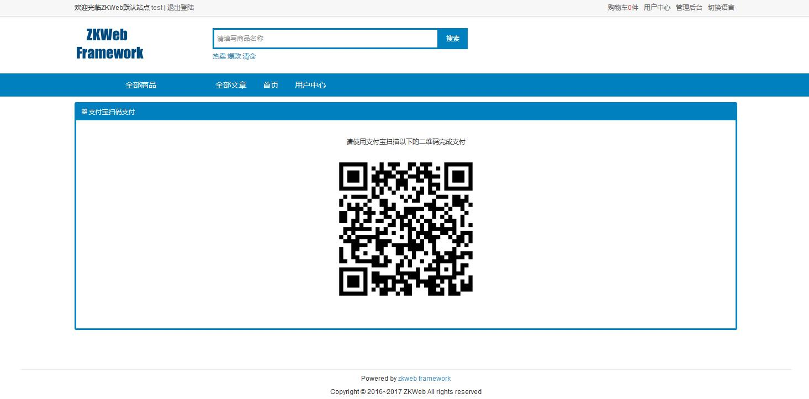

支付宝移动端插件提供了使用支付宝手机版付款的功能，基于支付插件的标准接口实现。 
这个插件具体支持了以下类型的支付宝支付

- 扫码支付

### 如何设置支付宝支付接口

- 设置商家Id和收款商家Id
	- 一般都以2088开始, 而且这两个Id一般都会一样
- 设置AppID
	- 一般都以日期开始, 例如20170306
- 设置RSA私钥
	- 请使用支付宝提供的键对生成器或者openssl生成RSA键对
	- 地址: [打开这个链接](https://doc.open.alipay.com/docs/doc.htm?spm=a219a.7386797.0.0.KNNc1L&treeId=291&articleId=106097&docType=1)
	- 生成时请选"非JAVA适用", 然后把私钥填到支付接口的设置中
- 设置RSA公钥
	- 把上面生成的公钥设置到支付宝中

### 扫码支付效果

### FAQ

- 扫码支付是如何确认支付成功的
	- 扫码支付会在扫码页面定期查询支付结果, 并且接受异步通知
	- 即使买家扫完码立刻关闭页面也可以通过异步通知使得交易支付成功
