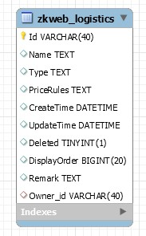
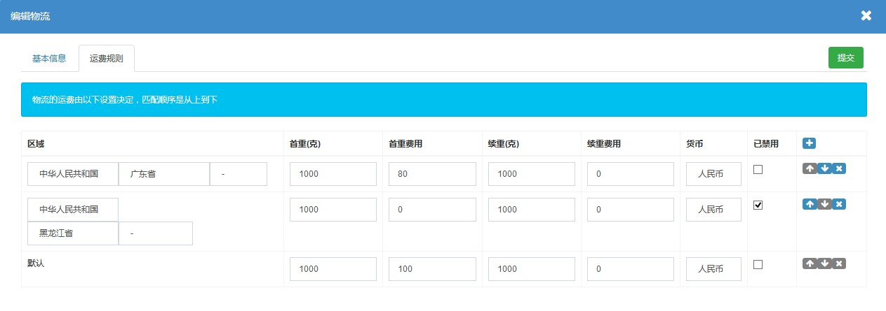

物流插件提供了物流的管理和运费计算功能。<br/>
物流支持按地区不同区分运费或禁止使用的功能。<br/>

### 物流的数据结构



### 物流的管理界面




### 获取物流列表

获取物流列表需要传入所属用户的Id，传入null时获取系统的物流列表。<br/>

```csharp
var logisticsManager = Application.Ioc.Resolve<LogisticsManager>();
var logistics in logisticsManager.GetLogisticsList(ownerId);
```

### 计算运费价格

计算运费价格需要传入物流，国家，地区Id和总重量(克)，<br/>
计算完成后返回((运费, 货币), 错误信息)，类型是`Pair<Pair<decimal, string>, string>`。<br/>
如果运费规则不能在传入的地区中使用，会返回一个错误信息。<br/>

```csharp
var logisticsManager = Application.Ioc.Resolve<LogisticsManager>();
var result = logisticsManager.CalculateCost(logisticsId, country, regionId, totalWeight);
```
