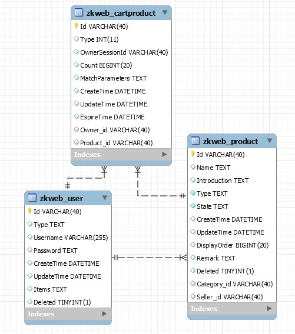
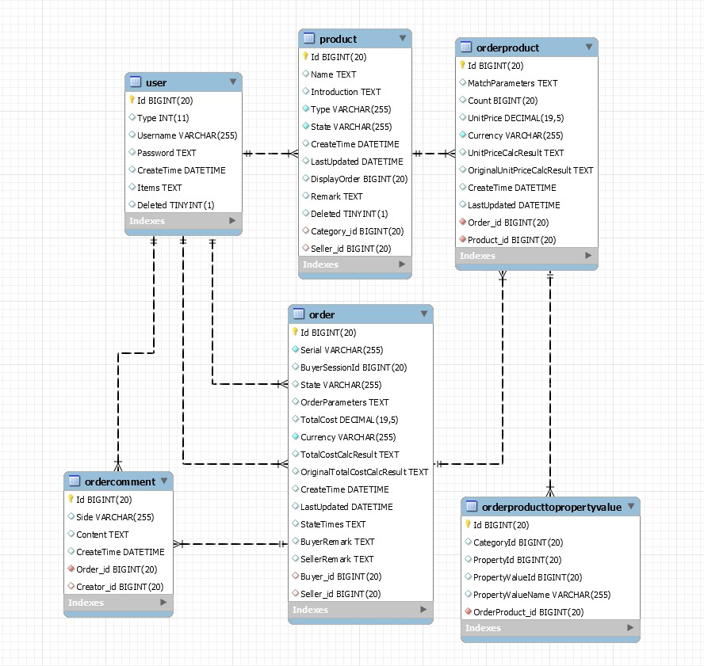
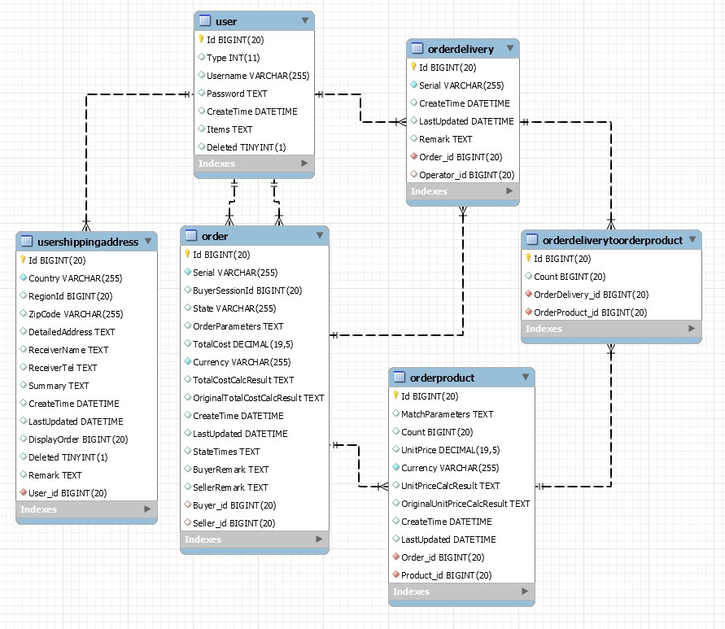

订单插件提供了购买商品相关功能，包括 

- 购物车
- 订单支付
- 订单管理
- 发货管理
- 收货地址管理

### 购物车的数据结构

购物车商品可以关联用户，也可以关联会话，如果开启了非会员下单，则不需要登陆也可以添加商品到购物车。 

### 订单的数据结构

一个订单对应多个订单商品，订单商品保存了下单时的商品价格等信息。 
订单可以关联买家和卖家，但不能关联多个卖家，如果购物车中有多个卖家的商品时会分别下单。 

### 发货单的数据结构

一个订单可以分多次发货，发货单关联了订单商品和发货数量。 
如果发货商品中包含了实体商品，应该选择物流和填写物流编号。 
订单和发货单会把用户填写的收货地址复制一份保存在内部，不会关联收货地址表中的数据。 

### 购物车页面

TODO

### 前台订单页面

TODO

### 后台订单页面

TODO

### 完整的订单流程

### 多卖家时下单的处理

### FAQ
