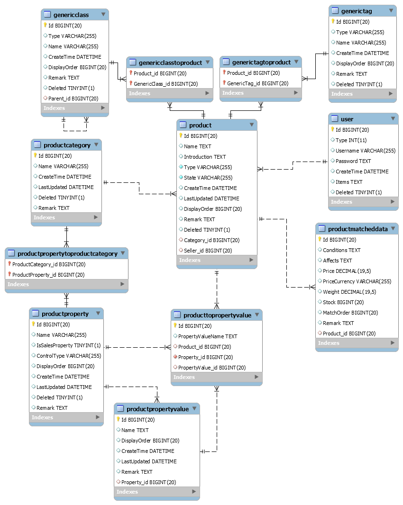

商品插件提供了商城使用的商品管理和展示功能。 
商品插件仅实现了最基本的商品功能，但提供了灵活的接口，可以在其他插件中实现更高级的功能。 

### 商品类目的数据结构

类目下有规格和属性， 
规格代表在购买时需要选择的值，例如颜色尺码套餐， 
属性代表只用于显示的值，例如年份品牌。 

### 商品的数据结构

商品可以关联多个分类和标签，商品可以选择一个类目并设置规格和属性。 
商品可以设置价格和库存的匹配规则，符合指定的条件时使用指定的价格和库存（可以把有填写库存的规则看成一个SKU）。 
商品可以设置对应的卖家，其他插件可以对有卖家的商品进行多店铺商城专用的特殊处理。 

