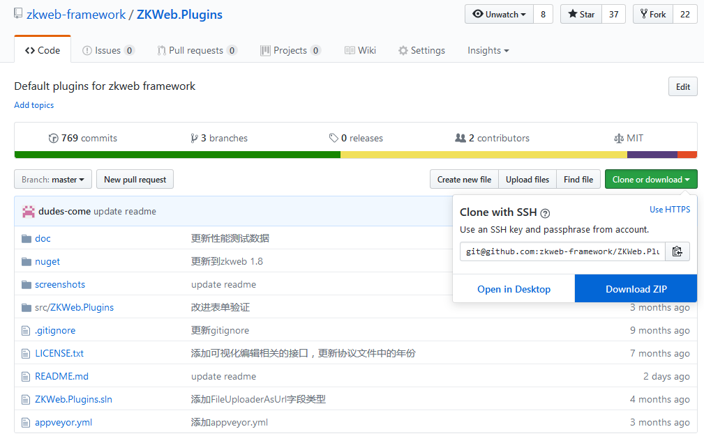
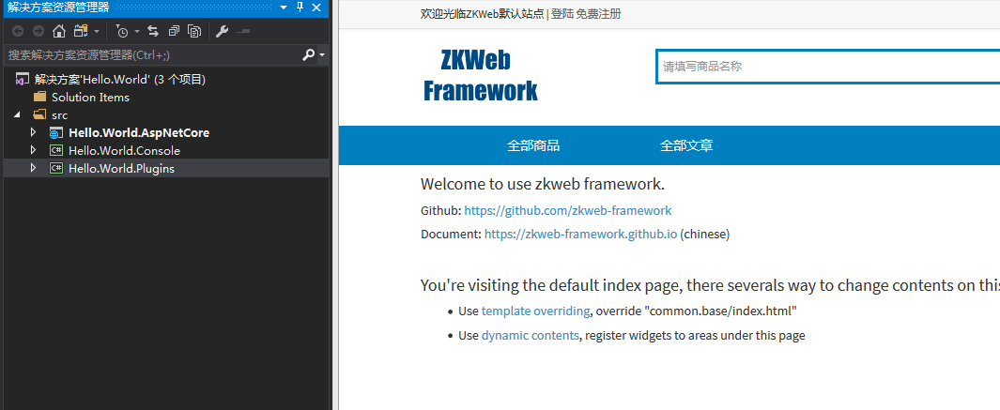
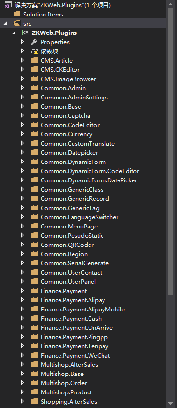
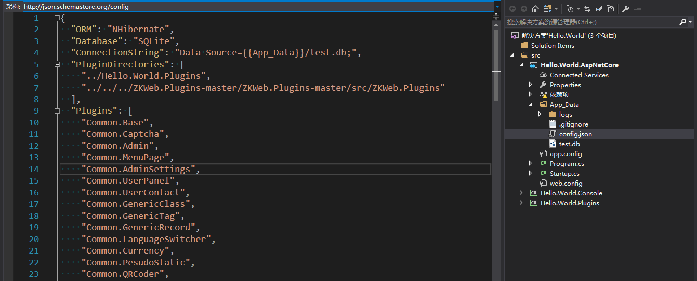

如果您已经看过[demo.zkweb.org](http://demo.zkweb.org), 并且想创建一个拥有相同功能的站点, 可以跟随下面的步骤.

### 下载ZKWeb

首先打开[ZKWeb的项目地址](https://github.com/zkweb-framework/zkweb), 然后点击下图的按钮下载到本地.

### 下载ZKWeb.Plugins

然后打开[ZKWeb.Plugins的项目地址](https://github.com/zkweb-framework/zkweb.plugins), 然后点击下图的按钮下载到本地.

### 使用项目创建器创建项目

打开'ZKWeb\Tools\ProjectCreator.Gui.Windows\ZKWeb.Toolkits.ProjectCreator.Gui.exe', 
可以看到下面的界面.

注意ORM里面只有"NHibernate"可以支持"ZKWeb.Plugins"中的所有插件, 
推荐选择 Asp.Net Core + NHibernate + SQLite,

然后选择"使用默认插件", 使用和上图一样的路径,

再选择输出文件夹后点击"创建项目"即可.

### 运行项目

打开项目运行后可以看到以下的界面:

### 多页面站点项目的结构

打开项目以后我们可以看到里面有"AspNetCore", "Console", "Plugins"三个项目,

"AspNetCore"项目仅用于启动网站, 里面不会放任何业务代码,

"Console"项目用于运单元和集成测试, 或运行一些临时的代码片段,

"Plugins"项目用于保存插件, 下面一个文件夹代表一个插件, 业务处理都会写到这个项目下面.

除此之外, 多页面站点还使用了刚才下载回来的"ZKWeb.Plugins"中的插件, 
"ZKWeb.Plugins"和"Plugins"项目一样专门用于保存插件, 
不同的是"ZKWeb.Plugins"的解决方案是独立的.

打开"ZKWeb.Plugins"可以发现里面有很多插件:

您可能只想使用一部分, 可以打开"AspNetCore\App_Data\config.json"删除不需要的插件, 如下:

注意如果插件之间有依赖关系, 删除一个插件可能会让关联的插件不能工作, 详细请看[插件系统](plugin/index.html).

### 了解更多

如果您已经成功创建和运行了多页面程序项目, 您可以继续:

- [了解网站结构](website_struct/index.html)
- [了解配置文件](website_config/index.html)
- [了解插件系统](plugin/index.html)

更多的内容可以查看左边的"核心文档".
