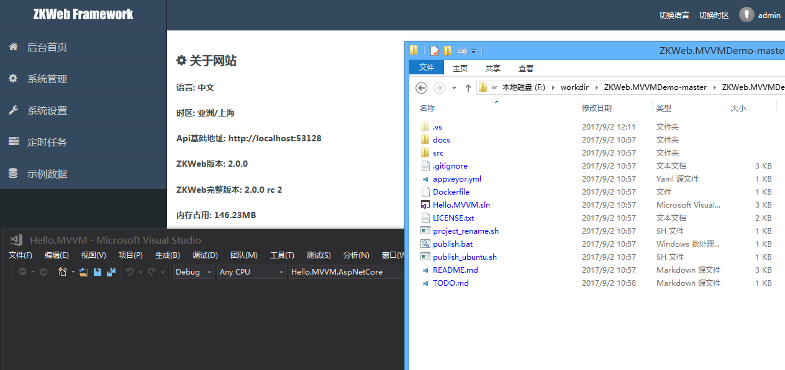

如果您已经看过[mvvmdemo.zkweb.org](http://mvvmdemo.zkweb.org),<br/>
并且想创建一个拥有相同功能的站点, 可以跟随下面的步骤.

和前两种项目不一样, MVVMDemo提供了Swagger支持和更好的整合Asp.NetCore,<br/>
请下载模板项目而不是使用项目创建器.

### 下载ZKWeb.MVVMDemo

首先打开[ZKWeb.MVVMDemo的项目地址](https://github.com/zkweb-framework/zkweb.mvvmdemo), 然后点击下图的按钮下载到本地.


### 重命名项目(可选)

如果您想修改项目名称, 可以使用"project_rename.sh"这个脚本.

使用脚本前您需要一个可以运行"sh"的shell, 可以安装[Git Bash](https://git-scm.com/download/win).

双击后可以看到以下的界面, 填写新的项目名称并且回车即可.


### 编译网站文件

因为MVVMDemo使用了AngularJS, 您需要先编译前端的网页文件.

安装[NodeJS](https://nodejs.org/en/download), 然后执行以下命令:

``` text
cd src/ZKWeb.MVVMPlugins/MVVM.Angular.Website/static
npm install
npm run build
```

编译成功后可以看到static下出现了dist文件夹.

如果npm安装速度很慢, 可以设置淘宝的镜像, 执行以下命令即可设置:

``` text
npm config set registry http://registry.npm.taobao.org
npm config set sass_binary_site http://npm.taobao.org/mirrors/node-sass
```

### 运行项目

打开项目运行后可以看到以下的界面:




### 单页面站点项目的结构

可以[参考这里](https://github.com/zkweb-framework/ZKWeb.MVVMDemo/blob/master/docs/cn/BackendStruction.md).

### 了解更多

MVVMDemo的文档是独立编写的, 您可以打开下面的地址了解更多:

[https://github.com/zkweb-framework/ZKWeb.MVVMDemo/tree/master/docs/cn](https://github.com/zkweb-framework/ZKWeb.MVVMDemo/tree/master/docs/cn)

也可以打开左边的"核心文档"了解关于ZKWeb本身的功能.
