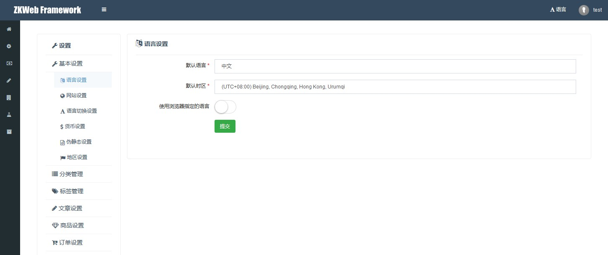

后台设置插件基于菜单页插件实现, 提供在同一个页面修改整个网站设置的功能.

### 后台设置页的效果


### 如何添加后台设置页（表单）

添加后台设置页需要继承`FormAdminSettingsControllerBase`.<br/>
以下是语言设置的源代码, 可以参考实现自己的设置页面.<br/>



``` csharp
/// <summary>
/// 语言设置
/// </summary>
[ExportMany]
public class LocaleSettingsController : FormAdminSettingsControllerBase {
	public override string Group { get { return "BaseSettings"; } }
	public override string GroupIconClass { get { return "fa fa-wrench"; } }
	public override string Name { get { return "LocaleSettings"; } }
	public override string IconClass { get { return "fa fa-language"; } }
	public override string Url { get { return "/admin/settings/locale_settings"; } }
	public override string Privilege { get { return "AdminSettings:LocaleSettings"; } }
	protected override IModelFormBuilder GetForm() { return new Form(); }

	/// <summary>
	/// 表单
	/// </summary>
	public class Form : ModelFormBuilder {
		/// <summary>
		/// 默认语言
		/// </summary>
		[Required]
		[DropdownListField("DefaultLanguage", typeof(LanguageListItemProvider))]
		public string DefaultLanguage { get; set; }
		/// <summary>
		/// 默认时区
		/// </summary>
		[Required]
		[DropdownListField("DefaultTimezone", typeof(TimezoneListItemProvider))]
		public string DefaultTimezone { get; set; }
		/// <summary>
		/// 是否允许自动检测浏览器语言
		/// </summary>
		[CheckBoxField("AllowDetectLanguageFromBrowser")]
		public bool AllowDetectLanguageFromBrowser { get; set; }

		/// <summary>
		/// 绑定表单
		/// </summary>
		protected override void OnBind() {
			var configManager = Application.Ioc.Resolve<GenericConfigManager>();
			var settings = configManager.GetData<LocaleSettings>();
			DefaultLanguage = settings.DefaultLanguage;
			DefaultTimezone = settings.DefaultTimezone;
			AllowDetectLanguageFromBrowser = settings.AllowDetectLanguageFromBrowser;
		}

		/// <summary>
		/// 提交表单
		/// </summary>
		/// <returns></returns>
		protected override object OnSubmit() {
			var configManager = Application.Ioc.Resolve<GenericConfigManager>();
			var settings = configManager.GetData<LocaleSettings>();
			settings.DefaultLanguage = DefaultLanguage;
			settings.DefaultTimezone = DefaultTimezone;
			settings.AllowDetectLanguageFromBrowser = AllowDetectLanguageFromBrowser;
			configManager.PutData(settings);
			return this.SaveSuccessAndCloseModal();
		}
	}
}
```

### 如何添加后台设置页（列表）

这个插件不仅提供了添加表单形式页面的接口, 还提供了添加列表形式页面的接口.<br/>
以下是通用标签的源代码（需要再次继承使用）, 可以参考实现自己的列表页面.<br/>


``` csharp
/// <summary>
/// 通用标签控制器的基础类
/// </summary>
/// <typeparam name="TController">继承这个类的类型</typeparam>
public abstract class GenericTagControllerBase<TController> :
	CrudAdminSettingsControllerBase<GenericTag, Guid>
	where TController : GenericTagControllerBase<TController>, new() {
	public virtual string Type { get { return Name.Replace(" ", ""); } }
	public override string Group { get { return "TagManage"; } }
	public override string GroupIconClass { get { return "fa fa-tags"; } }
	public override string IconClass { get { return "fa fa-tags"; } }
	public override string Url { get { return "/admin/settings/generic_tag/" + Type.ToLower(); } }
	public override string[] ViewPrivileges { get { return new[] { "TagManage:" + Type }; } }
	public override string[] EditPrivileges { get { return ViewPrivileges; } }
	public override string[] DeletePrivileges { get { return ViewPrivileges; } }
	public override string[] DeleteForeverPrivileges { get { return ViewPrivileges; } }
	public override string EntityTypeName { get { return Type; } }
	protected override IAjaxTableHandler<GenericTag, Guid> GetTableHandler() { return new TableHandler(); }
	protected override IModelFormBuilder GetAddForm() { return new Form(Type); }
	protected override IModelFormBuilder GetEditForm() { return new Form(Type); }

	/// <summary>
	/// 获取批量操作的数据Id列表
	/// </summary>
	/// <returns></returns>
	protected override IList<Guid> GetBatchActionIds() {
		// 检查是否所有Id都属于指定的类型, 防止越权操作
		var ids = base.GetBatchActionIds();
		var genericTagManager = Application.Ioc.Resolve<GenericTagManager>();
		if (!genericTagManager.IsAllTagsTypeEqualTo(ids, Type)) {
			throw new ForbiddenException(new T("Try to access tag that type not matched"));
		}
		return ids;
	}

	/// <summary>
	/// 表格处理器
	/// </summary>
	public class TableHandler : AjaxTableHandlerBase<GenericTag, Guid> {
		/// <summary>
		/// 构建表格时的处理
		/// </summary>
		public override void BuildTable(
			AjaxTableBuilder table, AjaxTableSearchBarBuilder searchBar) {
			var app = new TController();
			var dialogParameters = new { size = "size-wide" };
			table.MenuItems.AddDivider();
			table.MenuItems.AddEditAction(app.Type, app.EditUrl, dialogParameters: dialogParameters);
			table.MenuItems.AddAddAction(app.Type, app.AddUrl, dialogParameters: dialogParameters);
			searchBar.KeywordPlaceHolder = "Name/Remark";
			searchBar.MenuItems.AddDivider();
			searchBar.MenuItems.AddRecycleBin();
			searchBar.MenuItems.AddAddAction(app.Type, app.AddUrl, dialogParameters: dialogParameters);
			searchBar.BeforeItems.AddAddAction(app.Type, app.AddUrl, dialogParameters: dialogParameters);
		}

		/// <summary>
		/// 查询数据
		/// </summary>
		public override void OnQuery(
			AjaxTableSearchRequest request, ref IQueryable<GenericTag> query) {
			// 在第一页显示所有分类
			request.PageNo = 0;
			request.PageSize = 0x7ffffffe;
			// 提供类型给其他回调
			var app = new TController();
			request.Conditions["Type"] = app.Type;
			// 按类型
			query = query.Where(q => q.Type == app.Type);
			// 按关键词
			if (!string.IsNullOrEmpty(request.Keyword)) {
				query = query.Where(q => q.Name.Contains(request.Keyword) || q.Remark.Contains(request.Keyword));
			}
		}

		/// <summary>
		/// 排序数据
		/// </summary>
		public override void OnSort(
			AjaxTableSearchRequest request, ref IQueryable<GenericTag> query) {
			// 默认按显示顺序排列
			query = query.OrderBy(q => q.DisplayOrder).ThenByDescending(q => q.Id);
		}

		/// <summary>
		/// 选择字段
		/// </summary>
		public override void OnSelect(
			AjaxTableSearchRequest request, IList<EntityToTableRow<GenericTag>> pairs) {
			foreach (var pair in pairs) {
				pair.Row["Id"] = pair.Entity.Id;
				pair.Row["Name"] = pair.Entity.Name;
				pair.Row["CreateTime"] = pair.Entity.CreateTime.ToClientTimeString();
				pair.Row["DisplayOrder"] = pair.Entity.DisplayOrder;
				pair.Row["Deleted"] = pair.Entity.Deleted ? EnumDeleted.Deleted : EnumDeleted.None;
			}
		}

		/// <summary>
		/// 添加列和操作
		/// </summary>
		public override void OnResponse(
			AjaxTableSearchRequest request, AjaxTableSearchResponse response) {
			response.Columns.AddIdColumn("Id").StandardSetupFor<TController>(request);
			response.Columns.AddNoColumn();
			response.Columns.AddMemberColumn("Name", "45%");
			response.Columns.AddMemberColumn("CreateTime");
			response.Columns.AddMemberColumn("DisplayOrder");
			response.Columns.AddEnumLabelColumn("Deleted", typeof(EnumDeleted));
			var actionColumn = response.Columns.AddActionColumn();
			var deleted = request.Conditions.GetOrDefault<bool>("Deleted");
			var dialogParameters = new { size = "size-wide" };
			if (!deleted) {
				actionColumn.AddEditActionFor<TController>(dialogParameters: dialogParameters);
				actionColumn.AddDeleteActionFor<TController>();
			} else {
				actionColumn.AddRecoverActionFor<TController>();
				actionColumn.AddDeleteForeverActionFor<TController>();
			}
		}
	}

	/// <summary>
	/// 添加和编辑使用的表单
	/// </summary>
	public class Form : EntityFormBuilder<GenericTag, Guid, Form> {
		/// <summary>
		/// 标签类型
		/// </summary>
		public string Type { get; set; }
		/// <summary>
		/// 名称
		/// </summary>
		[Required]
		[StringLength(100)]
		[TextBoxField("Name", "Name")]
		public string Name { get; set; }
		/// <summary>
		/// 显示顺序
		/// </summary>
		[Required]
		[TextBoxField("DisplayOrder", "Order from small to large")]
		public long DisplayOrder { get; set; }
		/// <summary>
		/// 备注
		/// </summary>
		[TextAreaField("Remark", 5, "Remark")]
		public string Remark { get; set; }

		/// <summary>
		/// 初始化
		/// </summary>
		/// <param name="type">标签类型</param>
		public Form(string type) {
			Type = type;
		}

		/// <summary>
		/// 绑定数据到表单
		/// </summary>
		protected override void OnBind(GenericTag bindFrom) {
			if (bindFrom.Type != null && bindFrom.Type != Type) {
				// 检查类型, 防止越权操作
				throw new ForbiddenException(new T("Try to access tag that type not matched"));
			}
			Name = bindFrom.Name;
			DisplayOrder = bindFrom.DisplayOrder;
			Remark = bindFrom.Remark;
		}

		/// <summary>
		/// 保存表单到数据
		/// </summary>
		protected override object OnSubmit(GenericTag saveTo) {
			if (saveTo.Type == null) {
				// 添加时
				saveTo.Type = Type;
			} else if (saveTo.Type != null && saveTo.Type != Type) {
				// 编辑时检查类型, 防止越权操作
				throw new ForbiddenException(new T("Try to access tag that type not matched"));
			}
			saveTo.Name = Name;
			saveTo.DisplayOrder = DisplayOrder;
			saveTo.Remark = Remark;
			return this.SaveSuccessAndCloseModal();
		}
	}
}
```
